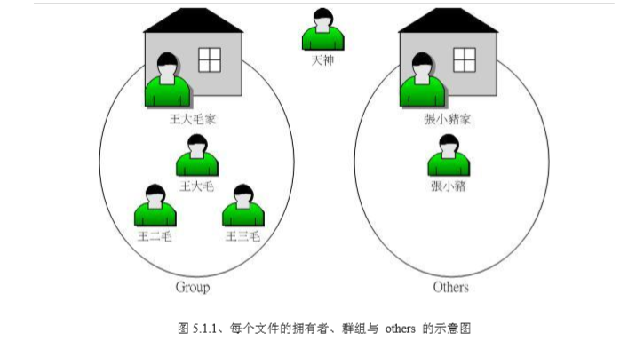
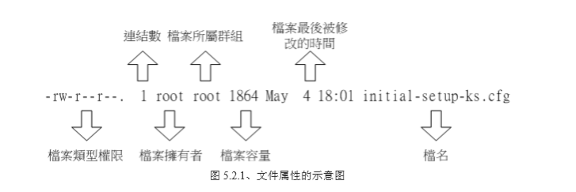
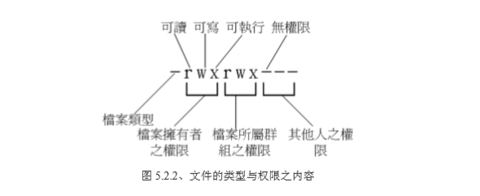

# 03-Linux文件权限与目录配置
## 03.1 使用者与群组
* 文件拥有者、群组、其他人的概念
* 关系可以用如下来解释（以王大毛为中心）
 

* Linux 用户身份与群组记录的文件

| 名称 | 所在目录 |
|:-- |:-- |
| root相关信息 | /etc/passwd |
| 个人密码 | /etc/shadow |
| 组名 | /etc/group |

## 03.2 文件权限概念
### 03.2.1 Linux文件属性
* 用ls -al 文件名查看（包括隐藏文件）：
```
[root@i-jjr0xl1a ~]# ls -al
  total 32
dr-xr-x---.  2 root root 4096 Dec 25 01:20 .
dr-xr-xr-x. 18 root root 4096 Dec 29 14:15 ..
-rw-------   1 root root 1345 Dec 29 14:42 .bash_history
-rw-r--r--.  1 root root   18 Dec 29  2013 .bash_logout
-rw-r--r--.  1 root root  176 Dec 29  2013 .bash_profile
-rw-r--r--.  1 root root  176 Dec 29  2013 .bashrc
-rw-r--r--.  1 root root  100 Dec 29  2013 .cshrc
-rw-r--r--.  1 root root  129 Dec 29  2013 .tcshrc
```

* 注意：这个文件容量是以byte为单位的，如果想要文件自适应大小，则可以用 ls -al -h 文件名这个命令。
```
[root@i-jjr0xl1a jun]# ls -al a.txt
-rw-r--r-- 1 root root 4113 Dec 29 15:46 a.txt
[root@i-jjr0xl1a jun]# ls -al -h a.txt
-rw-r--r-- 1 root root 4.1K Dec 29 15:46 a.txt
```

| 权限 | 连结 | 拥有者 | 群组 | 文件容量 | 修改日期 | 档名|
|:-- |:-- |:-- |:-- |:-- |:-- |:-- |
| -rw------- | 1 |root|root|1345|Dec 29 14:42|.bash_history|

* 文件属性的示意图如下:

  

#### 第一栏：代表这个文件的类型和权限

 


* 第一个字符代表这个文件是目录、文件或链接文件等等。

| 简写 | 含义 | 举例 |
|:-- |:-- |:-- |
| d | 目录 |dr-xr-xr-x. 18 root root 4096 Dec 29 14:15 ..|
| - | 文件 |-rw-------   1 root root 1345 Dec 29 14:42 .bash_history|
| l | 连结档（link file） | 暂无例子 |
| b | 装置文件里面的可供储存的接口设备（可随机存取装置） | 暂无例子 |
| c | 装置文件里面的串行端口设备（如鼠标、键盘） | 暂无例子 |

* 接下来的三个为一组，且均为 **rwx** 三个参数的组合
 * 第一组为文件拥有者可具备的权限
 * 第二组为加入此群组的账号的权限
 * 第三组为非本人且没有加入本组之其他账号的权限

| 参数 | 含义 |
|:-- |:-- |
| r | read（读） |
| w | write（写）|
| x | execute（执行）|
* r：read（读）；w：write（写）；x：execute（执行）

#### 第二栏：表示有多少档名连结到次节点
* 每个文件都会将它的权限与属性记录到文件系统的 i-node 中，们使用的目录树却是使用文件名来记录，因此每个档名会连结一个 i-node 号。
* 这个属性记录的就是有多少不同的档名连结到同一个 inode 号码

#### 第三栏：这个文件（或目录）的拥有着账号
#### 第四栏：这个文件的所属群组
#### 第五栏：这个文件容量的大小
* 默认单位byte
* 如果要让文件自适应，则ls -al -h

#### 第六栏：这个文件的建档日期或者是最近修改的日期
* 如果这个文件被修改的时间距离现在太久了，那么时间部分仅会显示年份而已。
* 如果想要显示完整的时间格式：ls -al -full-time

#### 第七栏： 这个文件的档名
* 如果档名之前多了一个 **.**，则代表这个文件为隐藏文件

## 03.2.2 如何改变文件属性与权限
* chgrp：改变文件所属群组
* chown：改变文件拥有着
* chmod：改变文件的权限，SUID,SGID,SUIT等等的特性

### chgrp：改变所属群组
* chgrp = change group
* 语法： chgrp [-R] group dirname/filename
```
 -R：进行递归（recursive）的持续更变，
     亦即连同次目录下的所有文件、目录都更新成为这个群组之意。
     常常用在变更某一目录内所有文件之情况。
```
* 前提：要被改变的组名必须要在 /etc/group 文件内存在才行哦~
* 例1：将/home下的b.txt修改到testing组（不存在），
```
[root@i-jjr0xl1a /]# chgrp testing /home/b.txt
chgrp: invalid group: ‘testing’
```
* 例2：将/home下的b.txt修改到jun组（存在）
```
[root@i-jjr0xl1a /]# chgrp jun /home/b.txt
[root@i-jjr0xl1a /]# ls -al -h /home/b.txt
-rw-r--r-- 1 root jun 0 Dec 29 17:38 /home/b.txt
```

### chown：改变文件拥有者
* chown =  change owner
* 语法： chown [-R] 账号名称 文件或目录 / chown [-R] 账号名称：组名 文件或目录
