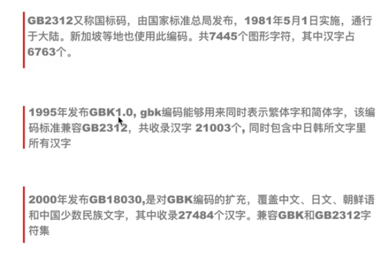
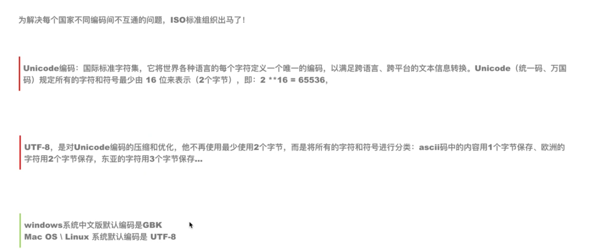

# 03-二进制

## 3.1 二进制定义
* 二进制是计算技术中广泛采用的一种数制。二进制数据是用0和1两个数码来表示的数。
* 它的基数为2，进位规则是“逢二进一”，借位规则是“借一当二”。
* 由18世纪德国数理哲学大师莱布尼兹发现。
* 当前的计算机系统使用的基本上是二进制系统，数据在计算机中主要是以补码的形式存储的。
* 计算机中的二进制则是一个非常微小的开关，用1来表示“开”，0来表示“关”。

## 3.2 python中如何将数字转换为二进制
* bin(数字)
```
>>> bin(342)
'0b101010110'
```

## 3.3 二进制与ASCII码
* 了解了二进制为计算机的运作机制，那么问题来了：计算机如何将二进制转换成文字？
* 英语使用国家推出了：ASCII码:美国信息交换标准码(255个)，将二进制转换为字母，即英语：


* 文字转二进制
  * ASCII码中表示最大的二进制是8位
  * 把所有二进制都转换为8位的，不足的用0来替换
    * 每一位0或者1所占的空间单位为bit(比特)，这是计算机中最小的表示单位
    * 8 bit = 1 byte 字节，最小的存储单位，1 byte缩写为1 B

## 3.4 二进制与字符编码
* 随着计算机的推广，那么又来了一个问题：一些使用汉语的的国家（比如：中国、新加坡、台湾等）也需要将二进制转换为文字，如何将二进制转换为字符呢？
* 答案：由二进制发展为文字的历程如下：




* 这些字符编码的转换随着不同国家转换为二进制的机制不同，造成国际间交流起来很麻烦，为了统一所有国家的编码问题，ISO推出了万国码，如下：




## 3.5 Python里使用编码
* python2里默认编码是ASCII，输入中文的时候会报错，需要申明：

```python
   #! -*- coding：utf-8 -*-
   #!encoding:utf-8
```
*  python2里默认编码是UTF-8，解决了python2.x的中文编码问题
