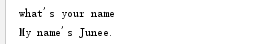
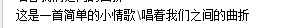
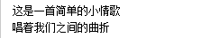
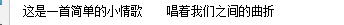
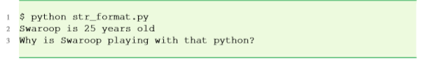
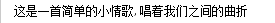

# 04-补充
## 4.1 数
* 在 Python 中数的类型有三种 —— 整数、浮点数和复数。
* 举个例子：
  * 0是整数
  * 3.10和52.3E-4是浮点数的例子。E表示10的幂。52.3E-4 = 52.3 * 10<sup>-4</sup>
  * (-5+4j)和(2.3-4.6j)就是负数
* 注意：python2.x中有长整型，但是python3.x中就没有，长整型一般数字后面多加了个L

## 4.2 字符串
* 字符串：即一串字符，字符可以是Unicode标准支持的语言

## 4.3 单引号
* 单引号用来指定字符串，如'Hello Wordl！'，单引号内的所有的空格和表符都照原样保留

## 4.4 双引号
* 在双引号中的字符串与单引号中的字符串的完全相同。

## 4.5 三引号
* 三引号其实和单引号、双引号也没多大的区别，但是在以下几种情况，必须用三引号：
  * 指示一个多行的字符串
  * 字符串中带有'或者"时，如'''What's your name'''

## 4.6 转义序列
### 4.6.1 \
* 假如你有一个字符串包含单引号（'），除了之前讲到的三引号，另一个选择就是：使用反斜线( \ )对字符串中的引号进行转义( .\ )， 进行转义后，python会明白中间的单引号是字符串中的一个字符，而不是字符串的结束标记。

```python
print("what\'s your name?")
print("My name\'s Junee.")
```
* 输出如下：



* 注意：在一个字符串中，在一行末尾的反斜杠仅仅表示下一行的字符串 是上一行的继续，但并不增加新的行。

```python
print("这是一首简单的小情歌"
      "\唱着我们之间的曲折")
```

* 输出如下：



### 4.6.2 \n
* 假如你想指定两行字符串，除了之前讲到的三引号，另一个选择就是：使用反斜线( \n )表示新的一行的开始。

```python
print("这是一首简单的小情歌\n唱着我们之间的曲折")
```
* 输出如下：



### 4.6.3 \t


* 另外一个有用的转义字符时 Tab 键: \t ，举个例子

```python
print("这是一首简单的小情歌\t唱着我们之间的曲折")
```

* 输出如下：



## 4.7 format方法
### 4.7.1 format举例
* 有时候我们并不想用其他信息来构造字符串，这时可以用format来构造

```python
age = 25
name = 'Swaroop'
print('{0} is {1} years old'.format(name, age))
print('Why is {0} playing with that python?'.format(name))
```

* 输出：



### 4.7.2 运行原理
* 一个字符串能使用确定的格式后，可以调用 format 方法来代替这些格式，参数要 与 format 方法的参数保持一致。
* 观察首次使用 0 的地方，这与 format 方法的第一个参变量 name 相一致。类似地， 第二个格式 1 与 format 方法的第二个参变量 age 相一致。
* 有关format的用法后面章节会细说。


## 4.8 逻辑行和物理行
* 物理行是你在编写程序时所看见的
* 逻辑行是Python看见的单个语句，Python假定每个物理行对应一个逻辑行
  * 逻辑行的例子如 print ’Hello World’ 这样的语句 —— 如果它本身就是一行（就像 你在编辑器中看到的那样），那么它也是一个物理行。
* 如果想要在一个物理行中使用多个一个逻辑行，那么你需要使用分号( ; )来标明这种用法。( ; )表示一个逻辑行/语句的结束。
* 例如：

```python
i = 5
print(i)
```

也可以写成
```python
i = 5;print(i);
```

还可以写成
```python
i = 5;print(i)
```
### 注意
* 建议：在每个物理行只写一句逻辑行。仅仅当逻辑行太长的时候，在多于一个物理行写一个逻辑行，和之前提到的用 \ 的方法连接，成为行连接。

```python
print('这是一首简单的小情歌,\
唱着我们之间的曲折')
```

* 输出如下：



## 4.9 缩进
### 4.9.1 什么是缩进？
* 啥是缩进？在每行开头的空白，称之为缩进；在Python中缩进非常重要。
* 在行首的主要的空白（空格键和制表符）用来决定逻辑行缩进的层次，从而来决定语句分组。 (Python中每一个缩进为4个空格)
* 意味着同一层次的语句必须有相同的缩进(错误的缩进会引发错误)。每一组这样的语句称为一个块。

### 4.9.2 如何缩进？
* 不要混合使用制表符和空格来缩进烈，建议你在每个缩进层次使用单个制表符或两个或四个空格。(选择一种风格，然后一贯地使用它，即只使用这一种风格)
