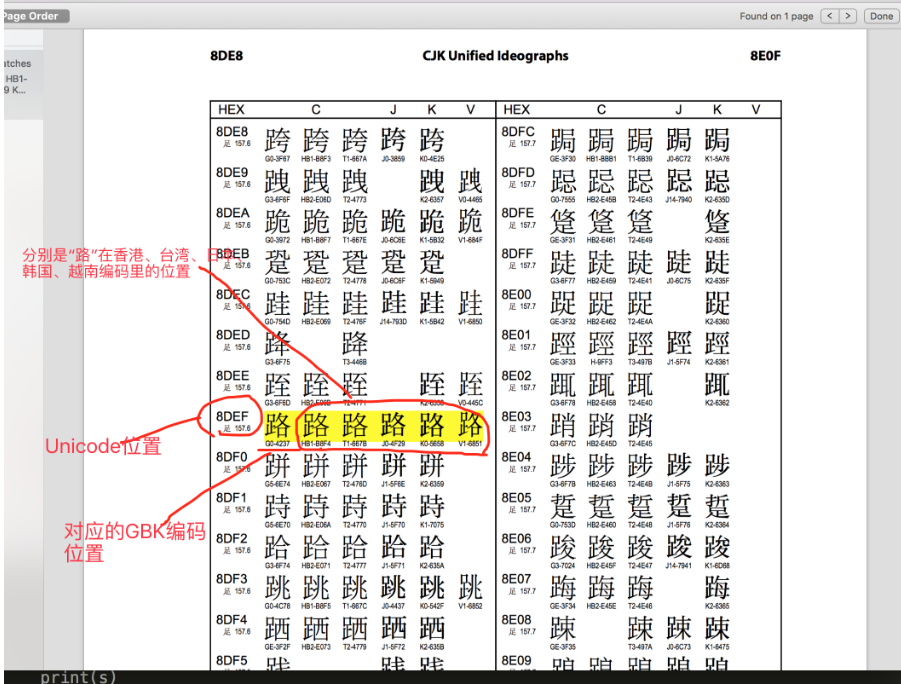
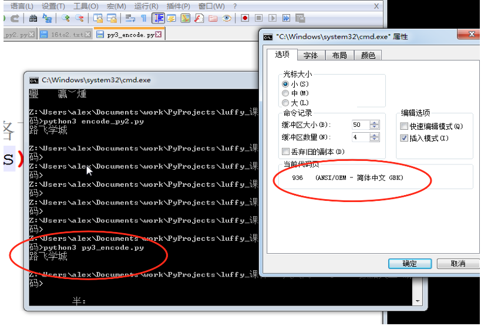
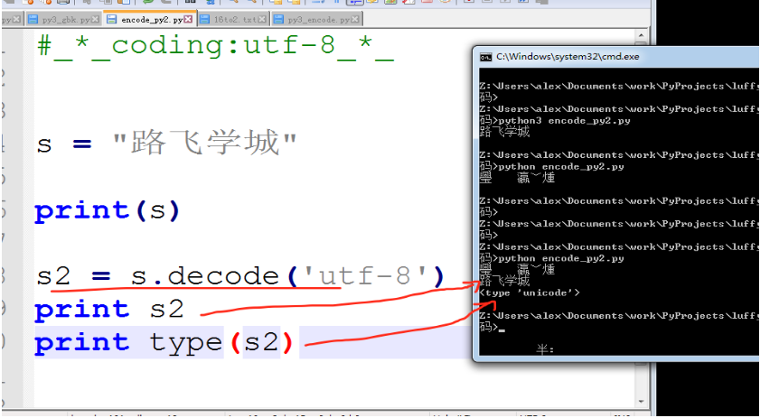
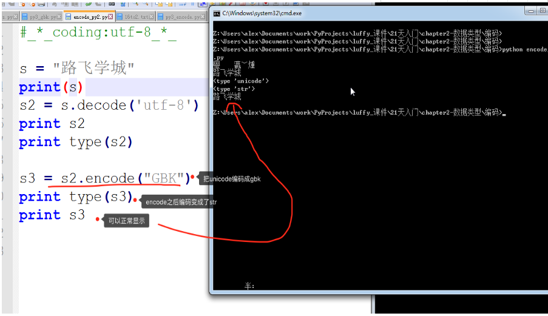
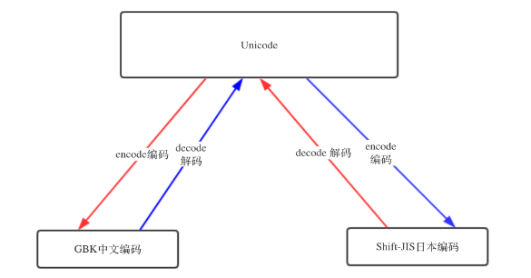
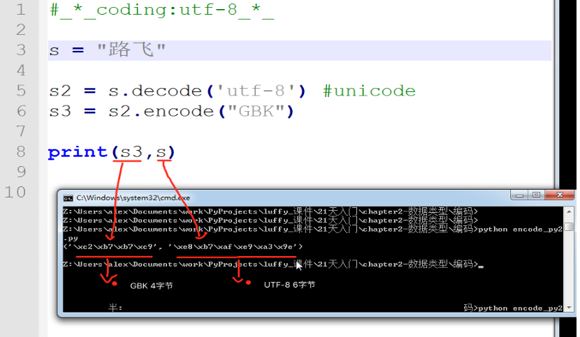
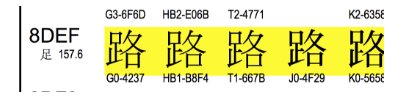
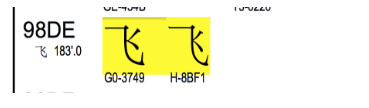
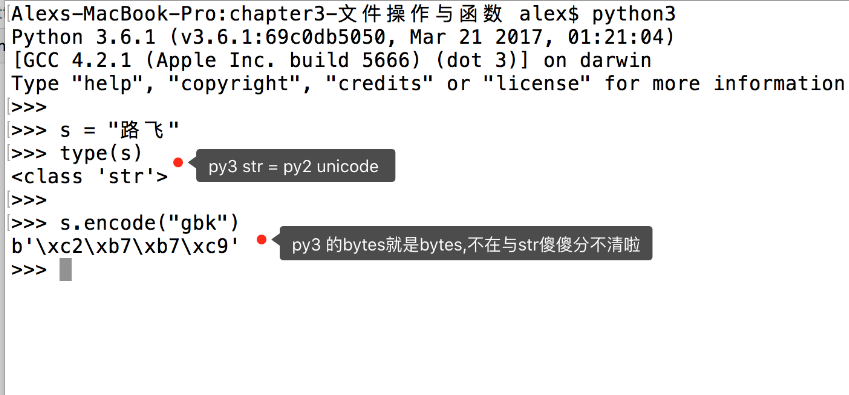

# 10-编码问题
## 10.1 编码回顾
### 10.1.1 编码类型

| 类型 |
|:-- |
| ASCII (1字节) |
| GB2312 (2字节) (支持6700+汉字) |
| GBK GB2312 (2字节) (支持21000+汉字) |
| Shift-JIS日本字符  (1字节) |
| ks_c_5601-1987 韩国编码   |
| TIS-620 泰国编码 |
| ... |


#### 1. Unicode的产生
* 由于每个国家都有自己的字符，所以其对应关系也涵盖自己国家的字符，但是以上编码都存在局限性，即：仅涵盖本国字符，无其他国家字符的对应关系。
* 为了解决这种问题，万国码产生了，涵盖了全球所有的文字和二进制的对应关系
  * Unicode 2-4字节 已经收录136690个字符，并还在一直不断扩张中...

* **Unicode优点**
  * 1.直接支持全球所有语言，每个国家都可以不用再使用自己之前的旧编码了，用unicode就可以了。(就跟英语是全球统一语言一样)
  * 2.unicode包含了跟全球所有国家编码的映射关系
* **Unicode缺点**
  * unicode表示一个字符，太浪费空间。
  * 例如：利用unicode表示“Python”需要12个字节才能表示，比原来ASCII表示增加了1倍。

#### 2. UTF的产生
* 由于计算机的内存比较大，并且字符串在内容中表示时也不会特别大，所以内容可以使用unicode来处理，但是存储和网络传输时一般数据都会非常多，那么增加1倍将是无法容忍的!
* 为了解决存储和网络传输的问题，出现了Unicode Transformation Format，学术名UTF，即：对unicode中的进行转换，以便于在存储和网络传输时可以节省空间!
* **UTF的类型**
  * **UTF-8**： 使用1、2、3、4个字节表示所有字符；优先使用1个字符、无法满足则使增加一个字节，最多4个字节。英文占1个字节、欧洲语系占2个、东亚占3个，其它及特殊字符占4个
  * **UTF-16**： 使用2、4个字节表示所有字符；优先使用2个字节，否则使用4个字节表示。
  * **UTF-32**： 使用4个字节表示所有字符
* 总结：UTF 是为unicode编码 设计 的一种在 **存储** 和 **传输** 时节省空间的编码方案。
* 注意：存到硬盘上时是以何种编码存的，再从硬盘上读出来时，就必须以何种编码读。

```python
ascii编码(美国)：
    l   0b1101100
    o   0b1101111
    v   0b1110110
    e   0b1100101
GBK编码(中国)：
    老   0b11000000 0b11001111
    男   0b11000100 0b11010000
    孩   0b10111010 0b10100010

Shift_JIS编码(日本)：
    私   0b10001110 0b10000100
    は   0b10000010 0b11001101

ks_c_5601-1987编码(韩国)：
    나   0b10110011 0b10101010
    는   0b10110100 0b11000010

TIS-620编码(泰国)：
    ฉัน  0b10101001 0b11010001 0b10111001
```

## 10.2 编码转换
### 10.2.1 编码国际交流问题
* 编码虽然有了unicode and utf-8，但是由于历史问题，各个国家依然在大量使用自己的编码，比如中国的windows,默认编码依然是gbk,而不是utf-8。
  * 如果中国的软件出口到美国，在美国人的电脑上就会显示乱码，因为他们没有gbk编码。
  * 那么怎么解决呢？

### 10.2.2 编码国际交流解决办法
* 1.让美国人的电脑上都装上gbk编码(不太可能实现)
* 2.把你的软件编码以utf-8编码(耗费时间精力)
* 3.**unicode包含了全球所有国家编码的映射关系**
  * 解决方式：gbk的“你好”,unicode通过映射能自动知道它在unicode中的“你好”的编码是什么，然后正常显示出来。

* 无论你以什么编码存储的数据,只要你的软件在把数据从硬盘读到内存里，转成unicode来显示，就可以正常显示了。



* 由于所有的系统、编程语言都默认支持unicode，那你的gbk软件放到美国电脑 上，加载到内存里，变成了unicode,中文就可以正常展示啦。

* unicode与gbk的映射表：http://www.unicode.org/charts/

## 10.3 Python3的执行过程
* 1.解释器找到代码文件，把代码字符串按文件头定义的编码加载到内存，转成unicode
* 2.把代码字符串按照语法规则进行解释，
* 3.所有的变量字符都会以unicode编码声明

## 10.4 编码转换过程
* 实际代码演示，在py3上 把你的代码以utf-8编写，保存，然后在windows上执行:

```Python
s = '路飞学城'
print(s)
```



## 10.5 隐藏的问题
### 10.5.1 Python2 和 Python3 区别：
* python3: 默认编码是utf-8，解释器能把utf-8转成unicode
* python2：默认编码是ASCII。中文必须声明文件头的coding为gbk or utf-8,之后，python2解释器仅以文件头声明的编码去解释代码，加载到内存后，并不会主动帮你转为unicode,文件编码是utf-8,加载到内存里，变量字符串就也是utf-8,意味着，以utf-8编码的文件，在windows是乱码。

### 10.5.2 Windows显示不乱码的情况：
* 1.字符串以GBK格式显示
* 2.字符串是unicode编码

### 10.5.3 解决Python2 乱码的问题
* **UTF-8 --> decode 解码 --> Unicode**
* **Unicode --> encode 编码 --> GBK / UTF-8**

* decode示例



* encode 示例



#### **规则**



## 10.6 如何验证编码转对了呢？
* 1.查看数据类型，python 2 里有专门的unicode 类型
* 2.查看unicode编码映射表

### 10.6.1 如何辨别Unicode 和 utf-8？
#### 1.字节长度判断(一般不用)
* unicode字符是有专门的unicode类型来判断的，但是utf-8,gbk编码的字符都是str，可以通过字节长度判断，因为utf-8一个中文占3字节，gbk一个占2字节



#### 2. 16进制的数与编码表匹配
* “路飞学城”的unicode编码的映射位置是：
  * u'\u8def\u98de\u5b66\u57ce' ，‘\u8def’ 就是‘路’，到表里搜一下。
* “路飞学城”对应的GBK编码是:
  * '\xc2\xb7\xb7\xc9\xd1\xa7\xb3\xc7' ，2个字节一个中文，"路" 的二进制 "\xc2\xb7"是4个16进制，正好2字节，拿它到unicode映射表里对一下， 发现是G0-4237，并不是\xc2\xb7


 


 

* 虽然对不上， 但好\xc2\xb7 和G0-4237中的第2位的2和第4位的7对上了，将16进制都转换为2进制：

```Python
路
C               2
8   4   2   1   8   4   2   1
1   1   0   0   0   0   1   0

B               7
8   4   2   1   8   4   2   1
1   0   1   1   0   1   1   1


飞
B               7
8   4   2   1   8   4   2   1
1   0   1   1   0   1   1   1

C               9
8   4   2   1   8   4   2   1
1   1   0   0   1   0   0   1
```

* 这个“路”还是跟G0-4237对不上， 但如果把路\xc2\xb7的每个二进制字节的左边第一个bit变成0，就可以对上了。

#### 原因
* 因为GBK编码在设计初期就考虑到了要兼容ASCII, 即如果是英文，就用一个字节表示，2个字节就是中文，但如何区别连在一起的2个字节是代表2个英文字母，还是一个中文汉字呢？

* 中国规定: 2个字节连在一起，如果每个字节的第1位(也就是相当于128的那个2进制位)如果是1，就代表这是个中文，这个首位是128的字节被称为高字节。 也就是2个高字节连在一起，必然就是一个中文。

* why？ 因为0-127已经表示了英文的绝大部分字符，128-255是ASCII的扩展表，表示的都是极特殊的字符，一般没什么用。所以中国人就直接拿来用了。

#### 问&答
* 问：那为什么上面 "\xc2\xb7"的2进制要把128所在的位去掉才能与unicode编码表里的G0-4237匹配上呢？

* 答：这只能说是unicode在映射表的表达上直接忽略了高字节，但真正映射的时候,肯定还是需要用高字节的哈。


## 10.7 Python bytes类型
### 10.7.1 什么是Python bytes?

* 在python 2 上写字符串

```python
s = "路飞"
print s
路飞
s
'\xe8\xb7\xaf\xe9\xa3\x9e'
```

* 虽说打印的是路飞，但直接调用变量s，看到的却是一个个的16进制表示的二进制字节，我们称之为 **bytes类型**，即字节类型，它把8个二进制一组称为一个byte,用16进制来表示。
* python2的字符串其实更应该称为字节串，通过存储方式就能看出来，但python2里还有一个类型是bytes，难道又叫bytes又叫字符串？
  * 是的，在python2里，bytes == str ， 其实就是一回事
* python2里还有个单独的类型是unicode , 把字符串解码后，就会变成unicode

```Python
s
'\xe8\xb7\xaf\xe9\xa3\x9e' #utf-8
s.decode('utf-8')
u'\u8def\u98de' #unicode 在unicode编码表里对应的位置
print(s.decode('utf-8'))
路飞 #unicode 格式的字符
```

### 10.7.2 Python bytes的变化

* 由于Python创始人在开发初期认知的局限性，其并未预料到python能发展成一个全球流行的语言，导致其开发初期并没有把支持全球各国语言当做重要的事情来做，所以就轻佻的把ASCII当做了默认编码。

* 当后来大家对支持汉字、日文、法语等语言的呼声越来越高时，Python于是准备引入unicode,但若直接把默认编码改成unicode的话是不现实的， 因为很多软件就是基于之前的默认编码ASCII开发的，编码一换，那些软件的编码就都乱了。

* 所以Python 2 就直接搞了一个新的字符类型，就叫unicode类型，比如你想让你的中文在全球所有电脑上正常显示，在内存里就得把字符串存成unicode类型。


```Python
s = "路飞"
s
'\xe8\xb7\xaf\xe9\xa3\x9e'
s2 = s.decode("utf-8")
s2
u'\u8def\u98de'
type(s2)
<type 'unicode'>
```

* 到了2008年，python发展已近20年，创始人龟叔越来越觉得python里的好多东西已发展的不像他的初衷那样，开始变得臃肿、不简洁、且有些设计让人摸不到头脑，比如unicode 与str类型，str 与bytes类型的关系，这给很多python程序员造成了困扰。


* 龟叔来了个大变革，Python3横空出世，不兼容python2,python3比python2做了非常多的改进，其中一个就是终于把字符串变成了unicode,文件默认编码变成了utf-8,这意味着，只要用python3,无论你的程序是以哪种编码开发的，都可以在全球各国电脑上正常显示，真是太棒啦！

* PY3 除了把字符串的编码改成了unicode, 还把str和bytes做了明确区分， str 就是unicode格式的字符，bytes就是单纯二进制啦。

 

### 10.7.3 One More Question
* 问：为什么在py3里，把unicode编码后，字符串就变成了bytes格式？ 直接打印成gbk的字符展示不好么？

* 答:其实py3的设计真是煞费苦心，就是想通过这样的方式明确的告诉你，想在py3里看字符，必须得是unicode编码，其它编码一律按bytes格式展示。 
